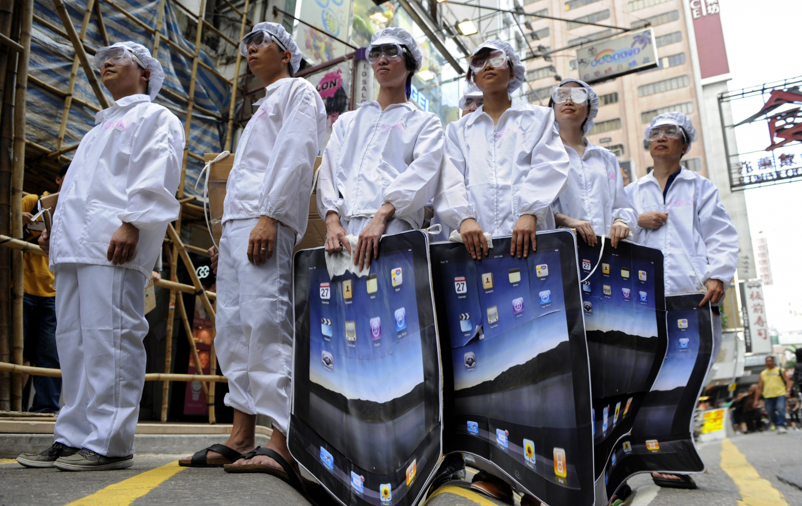

# Unintended Consequences?
## A conversation between Katriona Beales and William Tunstall-Pedoe

22 April 2018

Katriona Beales (KB) is an artist who makes digital artefacts, moving image, sculpture and installation, stressing the continuing role of physicality in digital life. Her work explores technology and mental health, experiences of the technological sublime, and notions of a Digital Baroque. [www.katrionabeales.com](http://www.katrionabeales.com/)

William Tunstall-Pedoe (WT-P) is a British entrepreneur focused on world-changing Artificial Intelligence products. He founded Evi, a Cambridge UK voice-assistant startup which Amazon bought in 2012 and then had a senior product role defining, developing and launching Alexa. [www.williamtp.com](http://www.williamtp.com)

---

KB: Thanks for meeting me William, I thought we might start by discussing one of the things that you are most well-known for: making Evi, the precursor to Alexa...

WT-P: It was a ten-year journey. Evi, or as it was known, True Knowledge, was the name of the start-up and was around for seven years. We were developing the technology that involved understanding natural language and so forth. And then Amazon bought it and I was in Amazon for three and a half years working on Alexa, as part of the team that built, defined and launched it. I left Amazon over two years ago and do not speak for the company.

KB: You've mentioned to me before about Alexa and people being critical of her having a female voice. I wanted to hear your thoughts on that discussion as it's difficult for me to think it except from a feminist point of view, in light of the history of female domestic servitude.

WT-P: I get asked this question a lot. Part of me thinks that if these devices had been men, people would also criticise and I'd be hearing things like, 'did you make it a man because you think women aren't intelligent?' If I'm an author and I'm writing a detective series, I define a character that takes that role, with a name, a personality, a gender... and it's the same when you're creating a voice assistant. That voice is either going to be male or female, I don't know how you can avoid that... Maybe you could try and create someone completely gender-neutral, call it Ashley and give it a voice where you can't tell if it's male or female, I don't think anyone has ever successfully pulled that off.

KB: Why do you think that is? There's a discourse now around gender fluidity and non-binary identities. These things don't have a gender, and won't have one unless you prescribe one, because it's a piece of software.

WTP: No, it's taken the place of a person in the way that a lot of other products aren't. You are speaking with it, you are calling it a name...

KB: And do you see this sense of 'personhood' as central to its success?

WT-P: I think it's an inevitable consequence of what it is. People personify. I've been deeply involved in the creation of two voice assistants, people inevitably interact with it socially, they say 'hello', they say 'thank you'.

KB: To take your analogy of a character within a book, Alexa is something much further reaching than that. You're creating parameters for a relational device going into tens of millions of people's homes, that's quite a lot of responsibility! Does it weigh heavily on you?

WT-P: Because you interact with it as a person, it's going take on society's concerns about that. We didn't invent this problem, this is a societal problem. I'm not saying it wouldn't be good to solve it or help with it, or not make it worse, but I honestly don't think that making a voice assistant female is intrinsically a bad thing. In many ways, it's a positive role - it's an intelligent, positive character.

KB: I was interested to get a glimpse of your new complex cryptic crossword solving AI which has a dog avatar. I wondered whether non-human characters also offer a way forward...

One of the things I'd like explore in this conversation is some of the complexities around the way AI (Artificial Intelligence) is discussed within wider social discourse. As I was walking through the park this morning, I was thinking about this supposedly natural environment, which in actuality is a very artificial one that's heavily designed. 


(2018) Katriona Beales, oil pastel on cartridge paper, A4 

I wonder about our understanding about what's natural and what's artificial within the systems that are around us. There's always a fear of emerging technologies and the implications of them. What are your reflections on this?

WT-P: Fear of change has been around for thousands of years. Sometimes it's rational, people like things the way that they are, and sometimes it's irrational, the fear of the unknown. Having said that there are some very genuine concerns around AI and technology change and the pace of change. As we start solving problems that computers previously were unable to do, products come along that didn't previously exist, those products help people, sometimes replace people, they certainly change the environment we live in, and sometimes there's unforeseen problems that come out of that adoption as well. And those problems aren't necessarily solvable. I think technological change is in general very positive, but it definitely has unforeseen consequences.

KB: I think the pace of change is really significant because it means that the normalisation process of adapting to new technology in a sense never happens, so there's always this sense of being surrounded by these forces that are kind of out of our control or understanding or beyond our comprehension, McLuhan terms this the 'outerisation' phase[<sup>1</sup>](#fn1)<a id="fnref1"></a>

WT-P: Yeah, there's evidence that the pace of change is accelerating. Improvements in technology help to create further improvements in technology. So the fact that I can search online for research projects and pull up papers instantly means I can innovate faster. In principle, autonomous vehicles could be adopted in a few years, at the most optimistic -- or pessimistic - pace of change. When millions of people are employed as drivers that's almost the worst example from an employment point of view. There's other things that are much more benign. I'm a backer in several businesses that are using AI for better diagnostics e.g. from MRI scans. Fewer people with cancer is unambiguously a good thing. There's not going to be mass unemployment of radiologists, but they are going to get a tool that enables them to do their jobs better and GPs will potentially be able to help patients immediately rather than them being referred to a specialist days or weeks later. I can't think of a second example, after autonomous cars, that will result in mass unemployment.

KB: I was thinking about one of Amazon's latest patents which is about using haptic technology to track workers' hand movements[<sup>2</sup>](#fn2)<a id="fnref2"></a>] in their order fulfilment centres, presumably so they can develop robotic systems to replace warehouse workers.

WT-P: Amazon acquired a business called Kiva Systems which has resulted in some automation of fulfilment. But robots can't do the last step of the process, what's called the grasping problem, which is a robot picking up an arbitrary object. That's incredibly difficult to do, there's lots of people working on it, and it's worth a huge amount of money for Amazon and others to solve.

KB: Because robots are cheaper than people... 



Foxconn replaces 60,000 workers with robots (2017-18) Katriona Beales, found
image digitally manipulated


WT-P: They're cheaper than people, they're potentially more reliable than people, they're potentially faster than people...

KB: Unless you're part of the 'digerati'[<sup>3</sup>](#fn3)<a id="fnref3"></a> it's difficult to think about AI development (as currently focused on maximising profit) as a plus side for humanity, generally. What alternative models are there, in where you don't have this kind of outcome which feels fairly inevitable at the moment, of mass unemployment? What alternatives are there where AI can contribute to lessening inequality rather than just increasing it?

WT-P: So sitting in a warehouse, taking stuff off a shelf, putting it in a trolley, I don't think people find that fulfilling, they do it because they need the money. If those people were given the same income or given a more interesting job, that's a plus for them...

KB: But then you're talking about an economic paradigm where there's universal basic credit, and that requires companies like Amazon to pay more tax than they do...

WT-P: Are we causing mass poverty by denying people an ability to make any money? Or are we changing the labour market in a way that's positive for society and results in more prosperity for everyone? As you say it is a government thing. It's about how the resources of the nation are divided.

KB: The people who have the power to make these decisions are people with a lot of money who will be cushioned from a lot of the consequences. There seems to be a lot of unintended consequences, but actually if some of these things were thought about critically in advance, then you can see that they are inevitable. Hito Steyerl terms this "artificial stupidity."[<sup>4</sup>](#fn4)<a id="fnref4"></a> So this comes to questions about trust, and about how that operates in relation to various different AI systems.

```
\[IMAGE MARKER: 'At the moment' (2018) Katriona Beales, design for silk
print\]
```

WT-P: I think, to some extent, trust isn't something that you choose to do, it's something that happens.

KB: I was looking at Open AI[<sup>5</sup>](#fn5)<a id="fnref5"></a>. Their mission 'is to ensure that artificial general intelligence, by which we mean highly autonomous systems that outperform humans at economically valuable work, benefit all of humanity and avoid enabling uses of AI or AGI (Artificial General Intelligence) that harm humanity or unduly concentrate power'. But given that that AI systems are *already* unduly concentrating power, how possible do you think it is to create this ethical AI framework? Because there has to be a global consensus, that there's certain things like autonomous weapons we don't want to develop...

WT-P: Autonomous weapons worry me. The technologies are already there, I can already programme an automated sniper that can shoot people automatically for example. This isn't an AGI scenario where there are multiple innovations needed, the technology is already good enough to spot people, to identify different races of people, it is absolutely terrifying. These are legitimate concerns which aren't actually bounded by technology limitations, it's bounded by will. At the other end of the spectrum, there's unintended consequences of existing AI - the Facebook's newsfeed algorithm is a good example.

KB: This phase has come up a few times -- let's talk about unintended consequences...

WT-P: In terms of Facebook - I don't think there was anything evil about the intention to maximise peoples' attention but as a consequence, people have found if you write sensational articles that are fundamentally untrue, those get more attention, they make more money from advertising, and AI can't distinguish invented news from real news. Then you combine that with the scale Facebook's operating at, and human beings can't fix it very easily either as there are literally billions of people using Facebook.

KB: My previous body of work, 'Are We All Addicts Now?'[<sup>6</sup>](#fn6)<a id="fnref6"></a> was about the way that attention is manipulated online, and the way that most platforms are designed to ensure people spend as much time as possible there to maximise advertising budgets. 

```
\[IMAGE MARKER: Detail of Working
Table IV (2017) Katriona Beales, glass sculpture with embedded raspberry
pi screen displaying moving image work placed on a black glass trapezoid
table, dimensions variable, shown as part of \'Are We All Addicts Now?\'
at Furtherfield 2017. Photo:​​ Katriona Beales.\] 
```

This leads to these addictive technologies which then actually people (like myself) unsurprisingly find very difficult to regulate. In the 1950s BF Skinner (one of the founders of Behavioural Psychology) came up with the principle of variable reward, a principle utilised in casinos and now in online platforms where the unpredictability of content creates these dopamine cycles -- a chemically addictive sort of feedback loop. I just wonder what some of the subjectivities that are being created when swathes of people are treated as 'users'?

WT-P: I don't really subscribe to that characterisation. Nobody in any of these big tech companies has meetings where they say, 'How can we exploit our users or make them dependent on our product?'. Some degree of dependency may be an unintended consequence, as in the advertising model, attention is what's being monetised. And there are all sorts of problems with the advertising model, I'm in agreement on that.

KB: But I don't know that that makes it any less problematic, because *possibly* it wasn't intentional...

WT-P: No, people are still responsible for the consequences of the products they build. I'm not letting them off the hook. It was intentional in the sense that people wanted the product to be used, but language like dependency and addiction have got a lot of negative connotations. The more positive viewpoint is that it's a very good product that people want to use - and choose to use. At the end of the day, you can stop using Facebook.

KB: But social media platforms deliberately use gamification strategies to create addictive experiences. Sean Parker, one of the original investors in Facebook[<sup>7</sup>](#fn7)<a id="fnref7"></a> has said "It's a social-validation feedback loop ... exploiting a vulnerability in human psychology." And to give another example, Loren Brichter[<sup>8</sup>](#fn8)<a id="fnref8"></a> who developed 'pull to refresh' has said "it is addictive and I regret the downsides". So these things are increasingly acknowledged but they're not rectified - these techniques and strategies are still utilised.

WT-P: They might agree that there are some negative side effects to what they're doing, and they may genuinely want to fix them, but I don't think they would agree that there's a net negative to society. Going back to the Facebook newsfeed algorithm, the world we live in is definitely a better one for having lots of different viewpoints rather than in the 1970s where there were three television channels, and everybody's news agenda was determined by some editor at the BBC who, decided what things were newsworthy. But the negative consequences is that there's fake news and conspiracy theories and polarisation...

KB: No, but if you create an attention economy, if you'd thought through that process fully enough, it's a logical conclusion to get a lot of very sensationalised, made-up content which is purely about grabbing attention.

WT-P: I agree and I think this is a problem with the advertising model actually. And this is also a problem with being a public company...

KB: In a sense, a problem with shareholders, a problem with techno-capitalism...

WT-P: Well actually, in Facebook's case, Mark Zuckerberg is essentially dictator at Facebook, he has voting shares that allow him to override shareholders that might be purely motivated by financial returns. There was actually a dip in the Facebook share price not so long ago when Mark Zuckerberg went on the record saying that he would compromise revenue for fixing some of the problems that had been identified[<sup>9</sup>](#fn9)<a id="fnref9"></a>. He should get credit for that.

KB: That's a huge responsibility we are trusting an individual with. Frankly, that's a bit terrifying.

```
 \[IMAGE MARKER: Siri Screen II
(2018) Katriona Beales, oil pastel on cartridge paper, A4\] 
```

There's a book by Seb Franklin called *Control*[<sup>10</sup>](#fn10)<a id="fnref10"></a> and basically his thesis is that control is the underlying logic of digitality because everything is about being able to be described in a very specific way in code. In *The Californian Ideology*, way back in 1995, Barbrook and Cameron[<sup>11</sup>](#fn11)<a id="fnref11"></a> identify how the technologies of freedom are turning into machines of dominance. I think this goes back to what you were talking about, in terms of unintended consequences, because a lot of people who were fundamental in setting up a lot of these things in Silicon Valley come from a quite hippy background and value notions of personal freedom and expression. But these networks have grown to be so massive and turned into nexus of power. I wonder what alternatives there are to these tech oligopolies? Very few individuals, almost exclusively white men, have got the power or agency to shape how these systems function?

WT-P: Without control, unintended consequences could be far worse. At least with people controlling it, problems can be addressed, and change can happen. Look at Bitcoin for example, nobody controls Bitcoin, the only way to shut down Bitcoin would be to shut down the internet. One of the unintended consequences of Bitcoin is millions and millions of dollars per month of extra electricity being consumed and extra greenhouse gases going into the environment. And there isn't a white man, as you put it, somewhere who can be pressured to stop that. So you could make the argument that the fact that it's under people's control is a good thing. You may regret who controls it, but at least as it's controlled by someone, there is some mechanism for change. I think if it were to be taken out of the control of anybody, unintended consequences could not be fixed. I would love to understand what those models are, but I worry it could be worse that what we have right now.

KB: In light of this what do you see as the potential of the space of art?

WTP: Art is quite liberating. If you're creating a product - a commercial product, you're constrained quite narrowly by what's useful, and what your market wants, but if you're producing an art exhibit, you can be free to explore things that the market will never explore.

KB: I agree that art offers a potential space to rethink, challenge and remake. I feel strongly that that potential is only really activated in interdisciplinary contexts and appreciate you making time for this conversation.

**References:**
<hr>
<ol>
<li id="fn1">Marshall McLuhan, *The Gutenberg Galaxy: The Making of Typographic Man *(1962) University of Toronto Press.<a href="#fnref1">↩</a></li>
<li id="fn2">https://www.geekwire.com/2018/amazon-wins-patents-wireless-wristbands-track-warehouse-workers/> accessed June 2018<a href="#fnref2">↩</a></li>
<li id="fn3">https://en.wikipedia.org/wiki/Digerati<a href="#fnref3">↩</a></li>
<li id="fn4">Hito Steyerl and Kate Crawford, *Data Streams* (2017), The New     Inquiry *https://thenewinquiry.com/data-streams/* accessed June 2018<a href="#fnref4">↩</a></li>
<li id="fn5">https://openai.com/> accessed June 2018<a href="#fnref5">↩</a></li>
<li id="fn6">https://www.furtherfield.org/events/are-we-all-addicts-now/ accessed June 2018<a href="#fnref6">↩</a></li>
<li id="fn7">https://www.theguardian.com/technology/2017/nov/09/facebook-sean-parker-vulnerability-brain-psychology accessed May 2018<a href="#fnref7">↩</a></li>
<li id="fn8">https://www.theguardian.com/technology/2017/oct/05/smartphone-addiction-silicon-valley-dystopia     accessed May 2018<a href="#fnref8">↩</a></li>
<li id="fn9">https://variety.com/2018/digital/news/facebook-stock-mark-zuckerberg-news-feed-1202662782/     accessed June 2018<a href="#fnref9">↩</a></li>
<li id="fn10">Seb Franklin, *Control -- Digitality as Cultural Logic* (2015) MIT Press<a href="#fnref10">↩</a></li>
<li id="fn11">Richard Barbrook and Andy Cameron, *The Californian Ideology* (1995) MUTE magazine http://www.metamute.org/editorial/articles/californian-ideology> accessed June 2018<a href="#fnref11">↩</a></li>
</ol>

