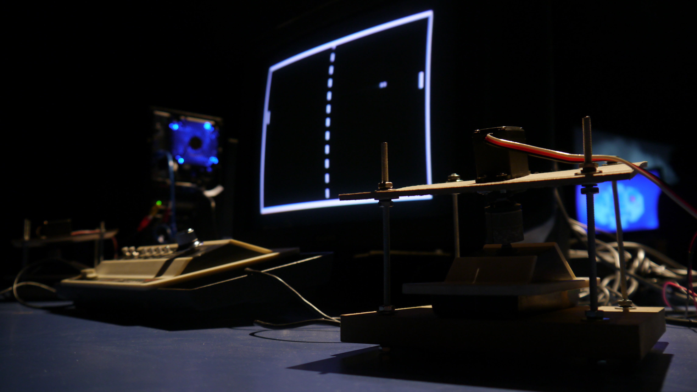
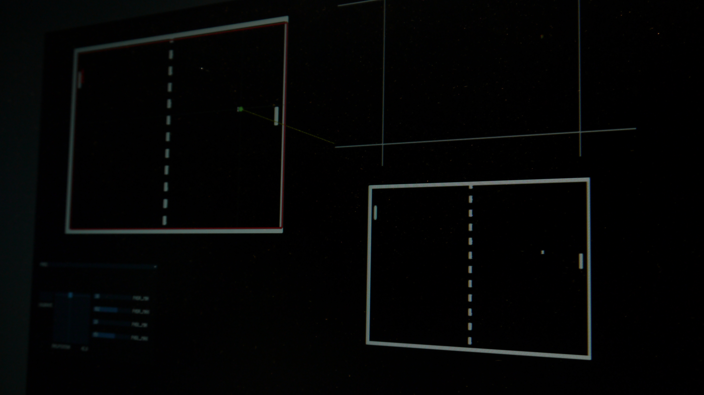

# Two computers playing Pong
## Merlina Rañi. +code curator
## Diego Alberti. artist

Two computers play Pong. Their computing power considerably surpasses the requirements for this old video game (the first to achieve commercial success). By the time the first ball is played, the match has already been defined; within this abstract dimension, it is nothing but a linear equation: the angle at which the ball will bounce is equal to the angle at which it originally hit. Everything else is a simulation, a projection through time and space. Different possibilities having been analyzed, there is always one answer, and what could be a potentially infinite match is limited to the available memory capacity.

The scope that this artistic gesture entails might be deemed absurd. It is hard not to consider this situation ludicrous; yet it constitutes in itself the possibility of competing against each other. This otherness, embodied by machines, gives way to the dilemma of a game in which there are no winners nor anything to win.

On the one hand, Two computers playing Pong presents us with a way of analyzing the nature of a computer. Besides encompassing notions such as autonomy, learning, intelligence or conscience (which indicate complexity), this computer-art installation uses an extremely simplified system to trigger the formulation of questions. In the first place, it shows what a computer can do when only a minimum of its potential is in use; all of this with the aim of gathering characteristic behavior and poetic patterns.

On the other hand, this piece represents the moment in which disregarding the interfaces changes the attribution of meaning and its interpretation. To clearly go through this aspect, it is necessary to look back in time...

In the film WarGames (John Badham, 1983), a computer that controls the military system of the United States, revolts, indirectly betraying its own creator and therefore proving that wars have no winners. The protagonist must teach the computer to lose, and finally realizes the only way to do so is by making it compete against itself.

One of the main characteristics of this film is that it portrays a moment in which the implementation of cybernetics for its original purpose (war industry and military strategy) connects and bonds with the following expansion it experimented among the commercial and home industries. However, it also focuses on another breaking point: the moment in which a computer is given power and control over key decisions, in the case of this film leading to World War III.

With cybernetics becoming increasingly popular, a new connection between human logic and IT comes into being; one that encourages us to question the way in which we perceive the world and form our conscience. Even in one of the dialogues the programmer addresses the General of military operations to ask him to think like a human and not like a machine.

The programmer probably appeals to a specific human trait: the benefit of the doubt; that is to say, the fact that the General's conscience might be masked under logic (associated to the computer), without him being aware of it.

Just as in WarGames, this game is not meant for humans, but rather IT techniques that compete and gain internal feedback, generate loops, define a good or bad match, and even create unexpected moves. The game takes place within the virtual capacity of fast and accurate calculations, and such tested and serialised capabilities now serve the most paradoxical way of leisure.

The game is a technical loop without time or space. Its only meaning is that of competing per se. There is no room for doubt; just the execution of a previously solved calculation. Computers are not able to discern between leisure and work, the material and the virtual world, nor game and reality. This lack of differentiation calls for a new way of reasoning which introduces new notions related to binarism, conscience, aesthetic and art.

The relationship between two computers and the idea of being left out of the game lead to questions about human nature: to what extent do we act freely? What are the similarities and differences between our semiotic programming and a computer's? Yet when adapting these matters to the scope of complex systems and more sophisticated relationships within IT and human logic, it is important to analyse the masks overpowering human conscience and how they affect our interpretation capability.

In the end, in spite of affiliations and fears, the relationship between humans and technology has changed in some kind of symbiotic process, and, as in the case of Two computers playing Pong, we are still unaware of the information flow or game that is at stake between machines and what we still call us.
