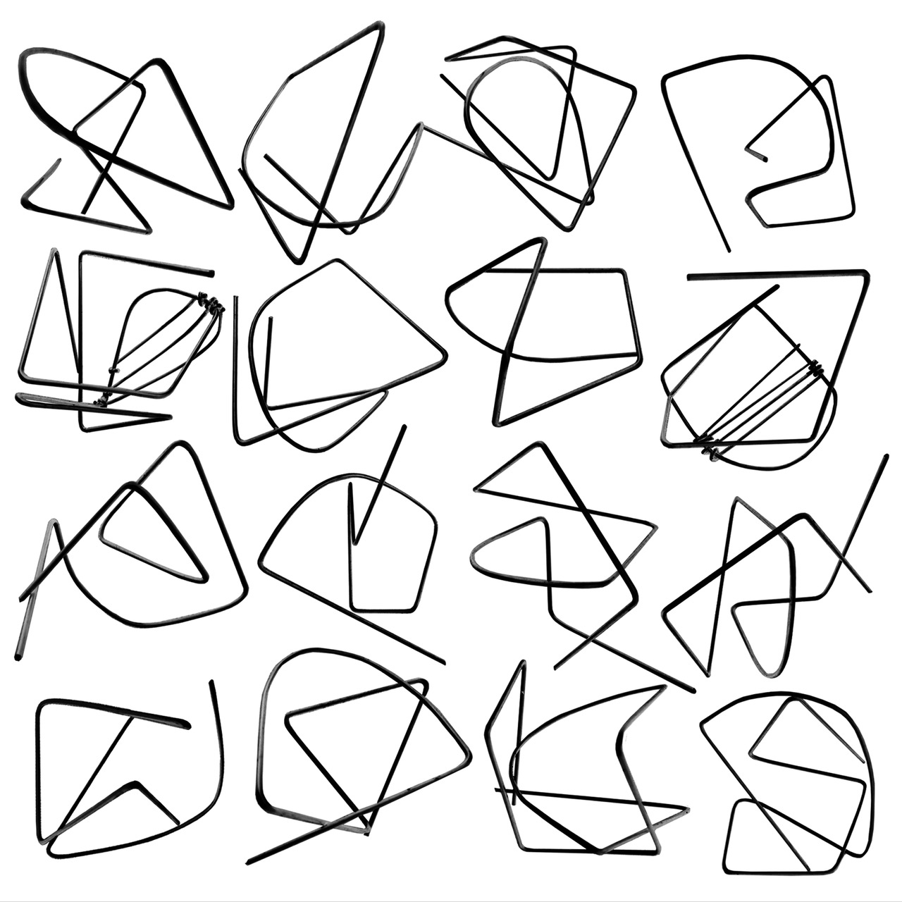
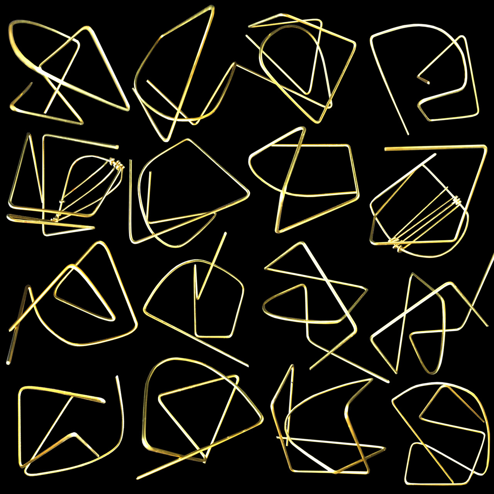
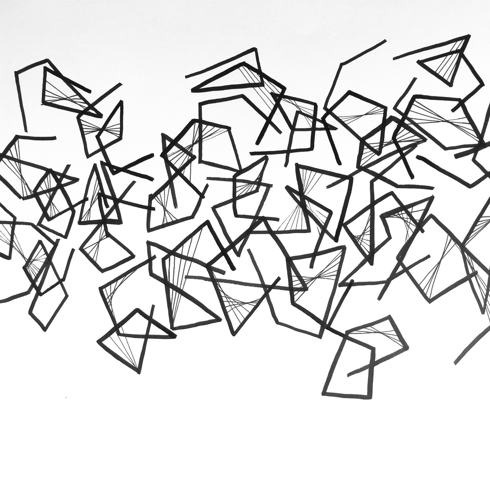
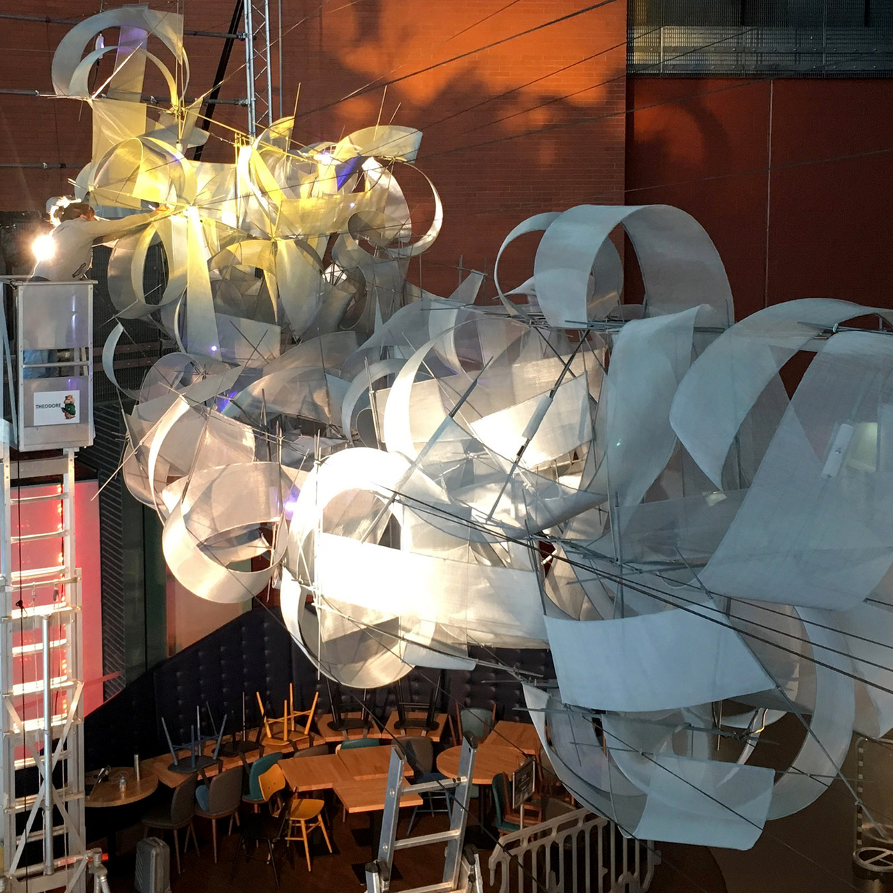

# Drawing Game
## Esther Rolinson and Sean Clark

Drawing Game is a live exchange of drawing marks made between artist Esther Rolinson and a drawing machine programmed by artist programmer Sean Clark. In Drawing Game a robot arm and Rolinson draw onto the same surface to build up rhythmic images. The impetus for the project is to uncover movement patterns in Rolinson\'s drawings that can be developed as programming behaviours in her light installation works. However, the process itself also opens up interesting questions around human and computer interaction. The work reflects their mutual interests in the nuances and structures of human movement.

To develop the Drawing Game computer programme Sean Clark has worked with data collected from a body of Rolinson's drawings created using a gesture capture app. This is one of a number of their investigations into the relationship between digital and hand made drawings. Each step and experiment reveals something about the complexity of human process and informs the requirements for a computer programme that can replicate a human gesture and interpret it as a time sequence.

Esther Rolinson makes light installations and sculptural works through drawing processes that are underpinned by computational systems. Her artworks are expressions of sensations and patterns of connections between things. She instinctively develops rules of construction that may be compared to building blocks or a musical riff. She uses these freely to disassociate from thought, allowing structures and shapes to arise from the process. She extends this approach into three dimensions, modelling forms and applying the same principles to construct large-scale works. The artworks are structural systems made from kits of parts that can be assembled in many different ways and scales in response to their site. At times they are connected to factors such as temperature, light and humidity via the Internet, tying them into subtle influences in their environment.

Rolinson's creative process is a meditation on her own experiences. She is interested in the idea that feeling and sensations have discernable structures that run through the body and connect us physically to our environment. In a simplistic way this can be observed in the dilation of pupils with excitement or fear and when cheeks flush with embarrassment. Her own experience is that:

> 'Connection to felt senses are a key to transformative states of being. Awareness of physical feeling can create release from past experiences and projected futures and bring us into the benign possibility of the present moment.'

Rolinson's drawings have a strong relationship to computer-constructed images and drawing machine processes in that they employ repeated actions to build up forms in an algorithmic-like manner. However, they are nuanced with spontaneity and gesture and each mark is unique rather than a true repetition.

An ongoing ambition in Rolinson's practice is to extend the flow of unpredictable movement and form found in her two and three-dimensional work into evolving time based sequences for lights.

Sean Clark's practice as an artist and programmer involves the creation of screen-based and 3D digital artworks that explore the nature of interactivity, flow and connectedness. Inspired by systems theory and cybernetics, he makes use of a wide range of computer hardware and software in his work, as well as 3D printing, electronics and digital lighting.

He has had a long interest in capturing and representing drawing activity that started in the early 1990s with his development of the ROCOCO Sketchpad multi-user drawing tool and drawing analyser. He also developed a locative iPhone drawing app called Dropsketch that enabled user sketches to be tagged with their location and shared through a map-based interface.

Sean Clark brings experience of understanding how drawing processes can be translated and interpreted through programming and the use of drawing machines. His works are systems that are always in a state of flux, exchanging all kinds of material and information in consistent patterns that have a dynamic equilibrium. Each system has an overall form that it is trying to achieve and it finds this through its own process of construction.

### DRAWING GAME

The first stage of developing the Drawing Game has been the production of a drawing gesture capture app by Sean Clark. It is essentially a minimal drawing tool that focuses on capturing the timing and precise movements in Rolinson's mark making. Its reductive quality aims not to interfere with the natural drawing process. Any excess user interface would be a distraction and the temptation to add multiple pen types, rulers and similar features has been resisted.

Drawing Game consists of a single 'pen', colour palette and pen-thickness selector. An 'undo' feature is available for enabling erroneous marks to be removed, but this is just for the removal of glitches, rather than as a part of the drawing process itself. Like all tools it has it's own characteristics that the user learns and employs, but the quality of using it quickly becomes secondary to what is being drawn.

The tool is optimised for use on an iPad or similar tablet, although it will work on a mobile phone or desktop computer. It captures all of the events related to the mark-making process, including the start, movement and end of each mark, the selection of colour and pen sizes and any undo's. Drawings made using the tool can be saved and played back in real-time. Every mark-making event captured is time-stamped so that both the rhythms of and between marks can be extracted. This is simplification of the full subtleties of the mark-making process, but it is proving to be a good starting point for the work.

After initial experiments making many different types of drawings the work is focused on a limited number of drawing rules. These have been developed in the evolution of paper drawings and physical sculptural structures. Even describing the rules of construction as it is seen requires experimentation. A set of drawing instructions is very open to interpretation and can create all kinds of varied results.

Drawing game, Esther Rolinson and Sean Clark.

With the rules to a first shape defined, the drawing machine in the game can be programmed to repeat what Rolinson has produced and respond with an appropriate version according to the rules. This has the potential to become a basic exchange. For this to work it is important that there is a mutual understanding for both parties. We can interpret the notion of understanding at the simple level of being able to analyse a process carried out by something else. An interesting point is that this process leads to the provocation of a question in the other. 'What does this computer know?'.... 'What version of the drawing is being made?'.......'What is the appropriate response?'

Through this process Drawing Game is a ground in which to explore the dialogue between the human and computer, potentially creating a genuine human and computer collaboration. It invites the player (or drawer) to externalise their internal process as they draw out what is in their mind/body and then respond to the computers version. When we codify behaviours it teaches us fundamental things about them. When we see then them generated in the physical world and respond to them we are influenced by an externalised version of our own imagination. It is like playing a game with a basic externalised self.

 

Drawing game, Esther Rolinson and Sean Clark.

Developing Drawing Game has an archaeological quality of discovery. We might consider that the movements and rhythms are already held inside the drawings and Rolinson's techniques. Drawing Game is a method to expand and study them so they might be redefined as algorithmic behaviours.

### SYSTEMS OF THE SENSES.

The first experimental work that has used very basic rhythmic sequences derived from the gesture capture app is Rolinson's large-scale prototype work 'Revolve', commissioned as a temporary installation at Curve Theatre, Leicester. It is a storm of unravelling forms that express a changing emotional landscape; like a weather front passing over a plain. It is a meditation on the transition from the noise of tangled thoughts to stillness, inspired by the sound of a humble voice powerfully punctuating silence. The work is made from undulating illuminated translucent shapes that build from one to another like climbing grey thunderclouds that are suddenly caught by bright sun. It is a nebulous, ephemeral structure built using simple rules of construction, a form becoming formless as it dissolves into nothing.

In essence 'Revolve' is the simple sensation of the build up and release of energy, something that we might experience every day. The evolution of Drawing Game is an important aspect of the work as the aim is to create a fully functioning structure. This would mean that all the elements it contains from the underlying supporting structure to the light movements are integral to how it works. We might compare it to a tree where there are many recognisable different parts like leaves and branches, but all are necessary for it to be a tree. The movement that animates the forms is crucial to the work.

### CONVERSATION

The Drawing Game raises questions about the nature of a conversation between a computer and a human. Rolinson and Clark have deliberately chosen to work with movement and senses rather than spoken language, engaging with fundamental aspects of humanness. As the work develops the quality of the conversation will evolve. Like any communication, for it to be satisfying and stimulating both must 'speak' a common language (in drawing) and have relevant and unpredictable contributions to make. The development of this active exchange might inform the language of human and computer interaction and is a subtle way of observing the internalised qualities of humanness.

The exchange of ideas and skill between Rolinson and Clark fuels the outcome. In both artists works we can see a likeness to living things that change and grow unpredictably. It is the combination of these two very different but related fields of work that creates a rich ground for exploring the connections between humans, sensations, systems and computers.

 
Drawing game, Revolve Prototype, Esther Rolinson and Sean Clark.
