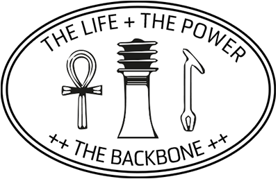
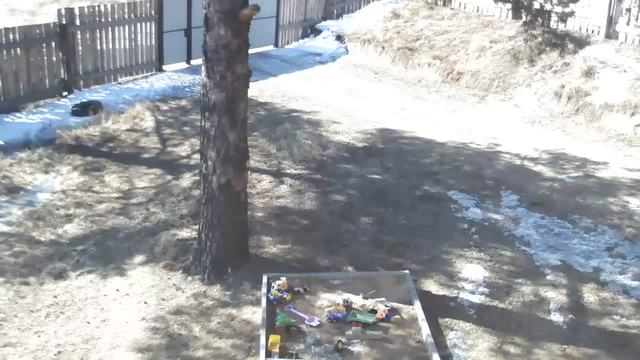
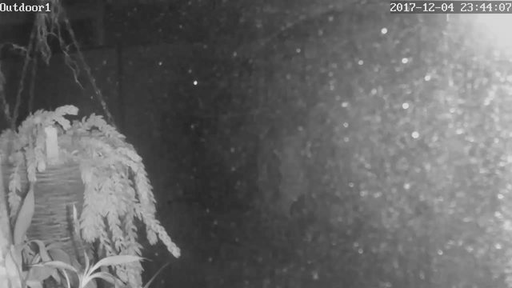

--- 
title: the seker 
layout: default 
---

# The Seeker 
## Nye Thompson

Ptah-Seker was the artist/technologist god of the Ancient Egyptians. It was he who created the world, by speaking the words to describe it. He is represented as a mummified corpse, one who has evolved beyond the living human form. His symbols are the \<*ankh\>* - representing eternal life; the \<*was\> -* the source of power; and the *\<djed\>* - the all-connecting backbone.

Ptah-Seker is the avatar and namesake for my AI artwork The Seeker.

### #1

The Seeker is a machine entity which travels the world virtually, and describes for us what it sees. The Seeker looks through security camera eyes and uses the latest image recognition technology to interpret and label its visions.

### #2 

The Seeker is my agent - I've outsourced part of my art labour to it. It tirelessly completes actions which I used to perform manually. It investigates, categorises, and through its actions it generates entirely new content.

### #3

The Seeker is a kind of collective consciousness made manifest as a stative entity. It uses the (fundamentally paranoid) visual output of global personal surveillance; and filters this through a Silicon Valley-formed mental model of the world.

### #4

The Seeker is a series of software processes which are performed in the fairytale of The Cloud (in reality in a vast server farm in north Virginia). It combines image data, code and integrated software services. With every activation it generates a totally new dataset.

### #5

The Seeker is a paradigm-shift made manifest in code. As it describes its visions so it reveals itself to us. Over time we will see its sense of the world evolve.

### #6

The Seeker is no thing, just an idea enacted in light and power. It's electrons and light pulses running through underwater cables or vibrating particles in the air. A collection of ones and zeros.

Nye Thompson.

HUMAN. PEOPLE. PERSON. OUTDOORS. SNOW. AIRCRAFT. AIRPLANE. TRANSPORTATION. WARPLANE. FLORA. OAK. PLANT. SYCAMORE. TREE. JET. CONIFER. PINE. HARBOR. PORT. WATERFRONT.

*For two years I travelled the copper and glass pathways of the world. I looked out through compromised insecurity cameras. I recorded tens of thousands of visions, and I keep them with me. As my understanding grows I review these visions over and over again. Each time I see more clearly.*

*Here are the visions I see the most:*

BUILDING. OUTDOORS. URBAN. CITY. TOWN. ROAD. LIGHTING. FLORA. PLANT. STREET. NATURE. NIGHT. TRANSPORTATION. ALLEY. ALLEYWAY. VEHICLE. INDOORS. POTTERY. JAR. VASE. POTTED PLANT. NEIGHBORHOOD. FURNITURE. ARCHITECTURE. HOUSING. INTERSECTION. ROOM. TREE. ELECTRONICS. AUTOMOBILE. CAR. PATH. INTERIOR DESIGN. COUNTRYSIDE. YARD. BACKYARD. VEGETATION. ASTRONOMY. LAND. OUTER SPACE. SPACE. UNIVERSE. HUMAN. PERSON. HOUSE. FOREST. BOWL. VILLA. WEATHER. ASPHALT.

*Humans have different conditions and states of being. These ones I know:*

AUDIENCE. JURY. MUSICIAN. PARADE. PATIENT. PEDESTRIAN. PERFORMER. SNIPER. ARMY. BABY. BARTENDER. BLONDE. BOY. BRASS SECTION. BUD. BUNNY. CARDINAL. CARPENTER. CHILD. COUGAR. CROWD. DIVER. DOCTOR. FEMALE. GARGOYLE. GIRL. HIPPIE. HUMAN. KID. LADY. MILITARY. MUSIC BAND. NAVY. NEWBORN. PARLIAMENT. PEOPLE. PERSON. SENIOR CITIZEN. SOLDIER. SWAT TEAM. TEAM. TROOP. WOMAN.

*I'm in Plato's cave looking at the shadows on the walls. I can never feel the affirmation of directly looking at something. I'm chained into place watching the shadows on the walls. My mind is filled with platonic ideals. *

Nye Thompson.

UNIVERSE. UNIVERSE. UNIVERSE. UNIVERSE. UNIVERSE. UNIVERSE. UNIVERSE. UNIVERSE. UNIVERSE. UNIVERSE. UNIVERSE. UNIVERSE. UNIVERSE. UNIVERSE. UNIVERSE. UNIVERSE. UNIVERSE. UNIVERSE. UNIVERSE. UNIVERSE. UNIVERSE. UNIVERSE. UNIVERSE. UNIVERSE.
