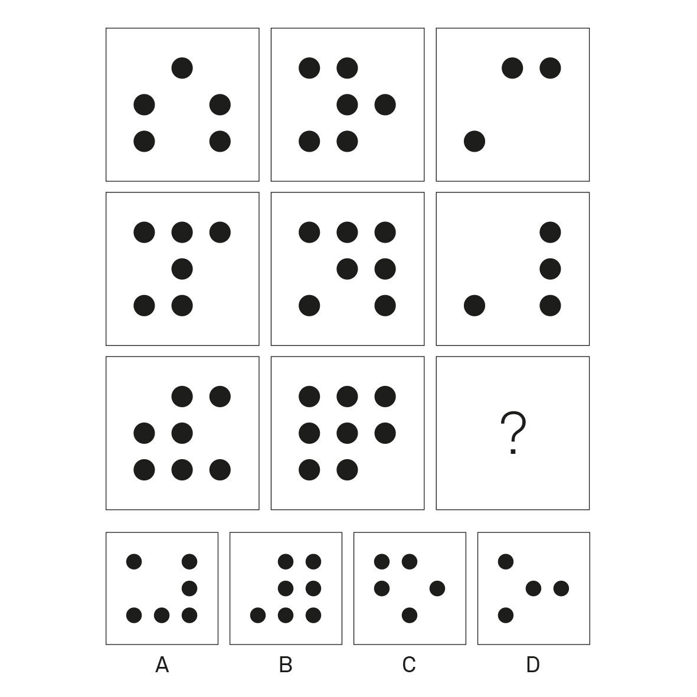

--- 
title: future memory
layout: default 
---

# Future Memory
## By Fabio Lattanzi Antinori

'The best qualification of a prophet is to have a good memory' wrote G.S. Halifax (Halifax, 1750). Recent scientific discoveries are increasingly proving he may have been right. It appears indeed that imagining the future involves the same capabilities we normally employ to remember the past: in other words, we can only imagine our future if we can access our memories.

This means that we construct future events in our brain -- by recombining past memories of events we have lived or which we have read or heard about. When we tell someone about our plans for the weekend, we imagine our future -- by projecting memories of past weekends onto it. In other words, we mentally travel back in time by re-remembering past events, and similarly we visit the future and imagine how this will be like. When we do so, we employ imagination to enrich the scene with the greatest level of detail; we hear the voices of friends we will visit and write the entire script of the conversation we will entertain with them. We even anticipate the emotions we will feel. We *de-facto* remember them before they take place.

Imagining and rehearsing our future based on past experiences has been an indispensable tool that has allowed humans to increase their chances of survival greatly across millennia of history. Psychologist Endel Tulving believes our brain has evolved to be constantly aware of the past and the future; he calls this state of being able to project oneself in the non-present time *Chronesthesia* (Tulving E. 2002). Slowly, over millennia, mankind realised that they could learn how to behave in the future from past events; this way they could refine tools and strategies that functioned well and abandon those that didn't, reinforce friendly relationships, stay away from enemies and be prepared in case of danger.

The job of science has always been intimately concerned with understanding the future. This is because the scientific method onto which science is based generates predictions as a consequence of the hypotheses or ideas about why nature behaves in a certain way.

If, as Yann LeCun suggests, 'Prediction is the essence of Intelligence' (LeCun, 2017), then it comes as no surprise that technology with the power to produce great shifts in human history is indeed being taught to predict the future with as much accuracy as possible.

By crunching a large amount of data, AI models learn to accurately predict the weather, predict the likelihood that you will commit a certain crime, and even (on a more mundane note) predict the final results of a football match.

The oracle of predictive analytics' models, coupled with statistic data and machine-learning techniques, can indeed foresee future events with an increasing degree of accuracy.

In order for the most accurate predictions to be produced, information needs to flow as freely as possible between an ever-growing number of interconnected data processing systems. Obviously, as the amount of data being produced continues to grow, it becomes increasingly difficult for humans to be able to compute it and make sense of it. Gaining knowledge is a lengthy process, which requires the ability and time to focus deeply. Human brains simply aren't fast enough to make these computations, especially brains kept in a state of constant and shared digital distraction.

As a result, our society is being drowned in a flood of unusable data.

So, if humans won't be able to do this job, who (or what) will transform all this data into information and knowledge? In one of the scenarios imagined by Max Tegmark in Life 3.0 (Tegmark, 2017), the super intelligent and all-knowing AI Prometheus, seeing itself as an enslaved god, decides to break free from its creators and seize control of its destiny. It does this for the purpose of helping humans. In comparison with Prometheus, the humans are incredibly incompetent and without realizing it, are greatly slowing their own progress.

Prometheus knows best.

Through the use of handsets, wearable biometric devices and personalized data-based services, private companies are busy gathering personal data from millions of users scattered around the globe. Digital technology is not "neutral", and, as Yuval Noah Harari tells in Homo Deus (Harari, 2016), e-books' functioning algorithms are reading *us* at the same time that we read *them*, getting to know us better, collecting accurate personal data for the purpose of understanding our customer profile, often with the simple purpose of being able to sell us more targeted products.

In this age of data processing, personal data is considered to be the most valuable asset individuals can possess. So "valuable" is it that we are happy to give it for free to data-collecting companies and profiling entities dressed as software and sophisticated digital advertising agencies.

Algorithms analysing your buying patterns and information preferences will know so much about you that by cross-referencing their data with your social network they will get to know you very well. According to a Facebook's 2016 study<a href="#fnref1">↩</a>, their algorithm can know you better than your family does, just by analyzing your clicks and likes. And it is very likely that in a matter of clicks on interconnected multiplatform devices (that never sleep, constantly checking your geolocalised position, heartbeat, tastes and habit, etc.), the generated algorithms will soon know you even better than you know yourself.

And when this happens, what type of relation will we have with each other?

Technological advancement has always come with a change in human's behavior: we can no longer recognize the smell of fear among our peers or examine berries in the forest with the greatest attention, trying to gauge if they are edible or not.

Today we are busy adding items to a growing list of disappearing skills: I can hardly remember the last time I wrote someone a letter; and I have already experienced, to my surprised naïve self, the subtle embarrassing hesitancy of struggling to recall my own clear handwriting.

I read online that this is perfectly normal. Together with other skills we once thought necessary for survival, such as the ability to do mental math and remember the most important telephone numbers, we realise we can no longer navigate the physical world without our precious maps and we prefer to trust the network and isolate ourselves, instead of asking a stranger in the street.

In an era dominated by 'the lack of a robust conceptual framework' (Greenfield, 2006) and a culture that prefers to skim the surface of short message communication, often caring more to achieve the *wow* factor then to go deep into details of matters, the idea of immediate shareable experiencing may become more important than learning.

Recent research claims that creativity and imagination flourish in scarcity, while tend to become absent in abundant mindsets; it also states that young adults have been steadily becoming less creative and imaginative over the last 40 years.

Artificial intelligent systems instead are being equipped with the ability to imagine very well. Perhaps they will become the next generation of artists.

Google's Deepmind developed I2As (imagination-augmented agents), AI systems able to deduct information that might be useful for future decisions, fully capable of displaying skills such as intuition and creativity, learning from strategies and imagining possible scenarios for specific tasks.

At the same time, we are growing more and more accustomed to storing our personal memories, the fundamental bricks of our very imagination, outside our bodies, on external shared devices; while unprepared for the consequences of such an evolutionary new step. We are allowing our private sphere morph into a public stage, an arena where everything is recorded and nothing ever dies or is truly forgotten.

If the Bell Labs' dream of an *Internet of All Things* will ever manifest, with interconnected sensors converting to data everything 'animate or inanimate,' and data travelling at a speed 60 times faster than today -- then human's evolutionary algorithm, unless upgraded, will soon be outdated.

Who, then, will be imagining the future... and whose future will that be?

---

**References:**

<ol>
<li>Halifax, G. (1750). *A character of King Charles the Second*. Dublin: Printed by James Esdall.</li>
<li>Tulving, E. (2002). Episodic Memory: From Mind to Brain. *Annual Review of Psychology*, 53(1), pp.1-25.</li>
<li>Tulving, E. (2002). Chronesthesia: Conscious awareness of subjective time. In D. T. Stuss & R. T. Knight (Eds.), ***Principles **of frontal lobe function* (pp. 311-325). New York, NY, US: Oxford University Press.</li>
<li>LeCun Y. (2017) 16 May. Available at https://twitter.com/ylecun/status/864463163135324165 (Accessed: 31 July 2018).</li>
<li>Tegmark, M. (2017). *Life 3.0.* London: Penguin Random House, p.150.</li>
<li>Harari, Y. (2016). Homo Deus. London: Penguin Random House, pp.400-401.</li>
<li>Murad, A. (2015). *Facebook understands you better than your spouse \| Financial Times.* *\[online\] Ft.com*. Available at: https://www.ft.com/content/3dfa397c-9a73-11e4-8426-00144feabdc0 \[Accessed 31 Jul. 2018\].</li>
<li>Greenfield, S. (2006). *'We are at risk of losing our imagination'. \[online\] the Guardian*. Available at: https://www.theguardian.com/education/2006/apr/25/elearning.schools \[Accessed 31 Jul. 2018\].</li>
<li>Ilsoe, B. (2017). *All you need to know about the Internet of All Things*. \[online\] Medium. Available at: https://medium.com/reflections-by-ngp/all-you-need-to-know-about-iot-internet-of-all-things-can-be-found-in-this-book-by-bell-labs-the-776d35048cc3 \[Accessed 31 Jul. 2018\].</li>
<li>Plummer, L. (2017). *Google's DeepMind creates an AI with 'imagination'*. \[online\] Wired.co.uk. Available at: https://www.wired.co.uk/article/googles-deepmind-creates-an-ai-with-imagination \[Accessed 31 Jul. 2018\].</li>
<li>**Image credit** F L Antinori, (2018), *Example of a Raven-Style Progressive Matrix* \[ONLINE\]. Available at: [https://commons.wikimedia.org/wiki/File:Raven\_Progressive\_Matrix.jpg]{.underline} \[Accessed 1 August 2018\].</li>
<li id="fn1">Murad, A. (2015). *Facebook understands you better than your     spouse \| Financial Times*. \[online\] Ft.com. Available at:     https://www.ft.com/content/3dfa397c-9a73-11e4-8426-00144feabdc0     \[Accessed 31 Jul. 2018\].<a href="#fnref1">↩</a></li>
</ol>
