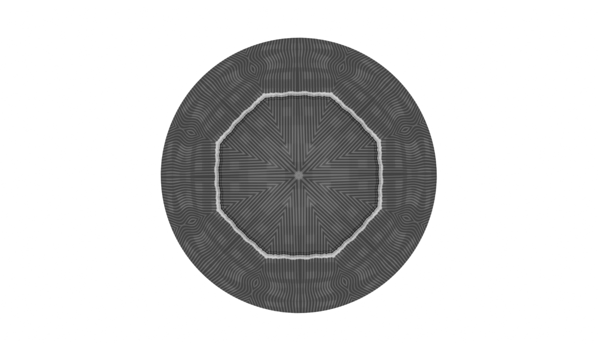
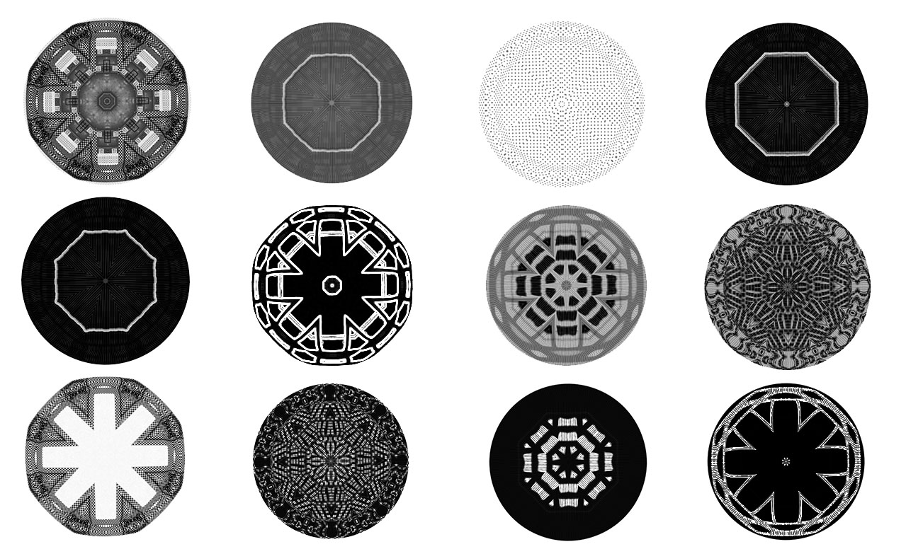

--- 
title: designing the mind
layout: default 
---

# Designing the Mind
**with Hyperacusis and Tinnitus**
##Luca M. Damiani
** London College of Communication - University of the Arts London
** www.lucadamiani-art.com

 “My Aspie with Tinnitus + Hyperacusis”, Luca M. Damiani, 2018.

### Introduction

In this piece for the V&A Digital Design Weekend 2018 programme, I look at the topics of hyperacusis and tinnitus, interpreting their related neurological activity via digital computing design.

Part of my academic practice is in the field of graphic media design and neuroscience, and with this project I aim to build a reflection that can lead to an exchange/conversation between the disciplines. With a micro case-study and auto-ethnographic (Chang 2009) and narrative research approach (Moen 2006), I worked on an artwork as a visual reflection on my own experience of tinnitus and hyperacusis. In this short-piece I am going to look into both conditions and how they have connected to my digital design practice; I will focus on my digital art piece "*My Aspie with Tinnitus + Hyperacusis*" based on my experience. It is a design-tech project interrogating the different ways of filtering hyperacusis and tinnitus and how they relate to each other, how they evolve with time, with pace, with rhythm, and how they connect to other neuro-sensorial activities and responses in the every day.

### Hyperacusis/Tinnitus within Digital Design

Hyperacusis is a hearing condition that is formed neurologically when processing everyday sounds. It is an auditory disorder characterized by abnormal loudness perception where sounds of relatively normal volume are perceived as too loud or even painfully loud (Diehl et Al, 2015). It creates an overload of auditory sensory experience as there is an increased neuro-sensitivity to volumes, frequencies and sounds of different types. It often occurs in parallel with certain degrees of tinnitus, which is a phantom hearing sound (Roberts et Al, 2010) that can take the form of whistling or ringing, pulsing or buzzing, and a variety of other ways. It is produced internally by the brain, creating constant soft, low, loud, high pitch acoustic patterns and it differs in its intensity from case to case. With tinnitus, the neural plasticity of the brain seems to increase its spontaneous firing rates and synchrony among neurons in the central auditory structures, randomly generating the phantom sound (Shore et Al, 2016). This can be continuous or alternate, and it can be bilateral or just on one side (one or both ears); this all connect to the amount of changes in neural activity in the auditory system (Lanting et Al). There is a disparity between what the brain predicts it should be hearing and the acoustic information that is delivered to the brain (Roberts et Al, 2013), which is why most cases are also associated with hearing loss, thus the brain creates phantom sounds to balance the lack of previous auditory levels it was accustomed to.

After an acoustic trauma caused by a sound accident while working in a gallery in January 2018, I began suffering from severe tinnitus and relative hyperacusis. Some of the effects of hyperacusis and tinnitus are very distressing, and can build-up also into misophonia (Baguley 2017) as well as anxiety and depression (McKenna et Al, 2010). In order to try to cope with it all, after a few months of suffering from these conditions, I started to use my artistic practice in digital media design to explore hyperacusis/tinnitus and their impact on my everyday life. I looked at them through an art&design lens alongside a variety of sound therapies, mindfulness/relaxing techniques and cognitive therapy programmes. I have also began to connect to my research investigation on neurodiversity (Damiani 2017, 2018) and so I tried to also self-reflect on Asperger's and how that can be affected by the hyperacusis condition (Stiegler and Davis 2010). With this I wanted to connect in the neurodiversity conversations and inclusive practices in artistic learning and education through the use of digital design. Inclusive practices have shaped a more in-depth observation of learning in art and design (Bhagat 2011); this brings us to look at more developments for further inclusive arts (Hatton 2015) that can be applied and shaped in different situations for different needs, building more inclusive discussions around neuroscience and the arts.

And so I have created a variety of media design outputs connected to my experience, reflecting and interpreting neurological reactions to sounds and situations. These outputs were also developed in collaboration with the "Design and the Mind" project (lead by fellow artist Natasha Trotman within the Wellcome Trust and Royal College of Arts) as well as in collaboration with the "Embodying Difference" project (lead by fellow artist Ali Northcott during her residency at the Centre for Research in Autism and Education at University College London). I have taken observation and exploration on neurodiversity and connected then methodologically and artistically to hyperacusis and tinnitus, as a primary phase of ethnographic development and processing -- I am yet to reach any conclusions! In the following part of the paper I explain and show (please see the video-link!) one of the digital media outputs I created as a specific artistic response that aims to mirror my current experience.

### My Aspie with Tinnitus + Hyperacusis

*"My Aspie with Tinnitus + Hyperacusis" (composition of frames) -- Luca M Damiani - 2018*

"My Aspie with Tinnitus + Hyperacusis" is a video-art piece [https://vimeo.com/272751962](https://vimeo.com/272751962), created in May/June 2018. It is part of my ongoing art therapeutic path-flow in connection to suffering from tinnitus (inner brain developed sounds) and hyperacusis (hypersensitivity to outer sounds), also considering its effect on my Asperger's. In this piece I try to reflect on specific patterns of sound processing and related/connected responses I experience of stress, anxiety, mood overload, emotional ups and downs. This piece is also a way for me to learn more about the conditions, cope with related stressful situations, balance and observe my reactions, and try to look at everything from the outside. It is part of a process and of a series of different works. The visual aims to explore the action of sound in affecting the overload of the brain. However, as hyperacusis builds up, an instinctual reaction is to cut sounds off with hearing protections, wearing sound-filtered ear-plugs, using additional sound-removal headphones, covering the ears in all possible ways. By doing this however, tinnitus kicks in with more strength, complicating the balance and solution. With this piece I am visually recalling the sound experience but filtering it in silence, focusing on movement and interpreting neuro reactions of central nervous system, trying to reflect the speed of changing patterns, avoiding and stressing about noisy situations, filtering inputs of sound and movement, repetitions of 'cutting' and pain in the hearing. All this requires a constant balancing of situations and with this art-piece I tried to visualise my reaction to it and how that affects my mental flow at different moments and stages. Indeed the artwork started, at first, as an artistic-therapeutic response; but it then felt appropriate to use it for my research and artistic development, reflecting critically on it and using it to prompt and allow further discussions. This, in itself, also helps to keep a healthy development within cognitive psychology in order to learn more about the condition and its patterns and so learning how to avoid entering into a tunnel of negative thoughts. The overall artwork is divided in several stages - each stage represents moments of calm, moments of distress, moments of overload, moments of building-up, moments of channeling, moments of pain. I worked on this piece constructing and re-constructing a narrative that would connect to my own observation of the brain focus, data processing, first overloads, re-focus, and then up to higher overload mode. During various weeks I have collected the data and then processed these inputs in geometrical forms, reflecting an intricate pattern of moments with a timeline that can show different neurological responses and feelings of brain processing of sound.

### Conclusion

With this brief art-academic paper I wanted to have an initial creative conversation on the condition, and I also wanted to share one of the work developed during my therapeutic process. It is just a first glance into the media designs and observations I am collecting, using them as a theoretical, conceptual and methodological frame of artistic approach. These responses branch-up from my individual experience to a more inclusive open discussion and I have aimed to use the artworks ("My Aspie with Tinnitus + Hyperacusis", and also other explorations) as a stimulus for conversations and exchange in relation to design and the working of the brain.

---

**References:**

<ol>
<li>Baguley D. (2017) Hyperacusis and Misophonia - Annual Tinnitus Research Review 2017, British Tinnitus Association</li>
<li>Bhagat D. and O'Neill, P. (2011) Inclusive practices, inclusive pedagogies: Learning from widening participation research in art and design higher education. Croydon: CHEAD.</li>
<li>Chang H. (2009) Autoethnography as Method (Developing QualitativeInquiry). Routledge.</li>
<li>Damiani L. (2017) Art, Design and Neurodiversity -- Electronic Visualisation and the Arts, British Computer Society</li>
<li>Damiani L. (2018) On the Spectrum within Art&Design Academic Practice. UAL Spark Journal, Vol. 3</li>
<li>Diehl P. and Schaette R. (2015) Abnormal auditory gain in hyperacusis: investigation with a computational model -- Frontiers in Neurology</li>
<li>Hatton K. (2015) Towards an inclusive arts education*.* London: Trentham.</li>
<li>[Lanting</li>
<li>CP](https://www.ncbi.nlm.nih.gov/pubmed/?term=Lanting%20CP%255BAuthor%255D&cauthor=true&cauthor_uid=19545617), de Kleine E, van Dijk P. (2009) Neural activity underlying tinnitus generation: results from PET and fMRI. - Hearing Research</li>
<li>McKenna L., Baguley D., McFerran D. (2010) Living with Tinnitus and Hyperacusis -- Sheldon Press</li>
<li>Moen T. (2006) Reflections on the Narrative Research Approach -- International Journal of Qualitative Methods</li>
<li>Roberts L., Eggermont J., Caspary D., Shore S., Melcher J. and Kaltenbach J.(2010) Ringing Ears: The Neuroscience of Tinnitus - Journal of Neuroscience, Vol 30</li>
<li>Roberts L., Husain F., Eggermont J. (2013) Role of attention in the generation and modulation of tinnitus. </li>
<li>in Neuroscience & Biobehavioral Reviews, Vol 37, Issue 8</li>
<li>Shore S., Roberts L., Langguth B. (2016) Maladaptive plasticity in tinnitus\--triggers, mechanisms and treatment. In Nature Reviews Neurology, Vol 12</li>
<li>Stiegler L., Davis R. (2010) Understanding Sound Sensitivity in Individuals with Autism Spectrum Disorders -- in Focus on Autism and Other Developmental Disabilities, Sage Journal, Vol 25, Issue 2</li>	
</ol>
