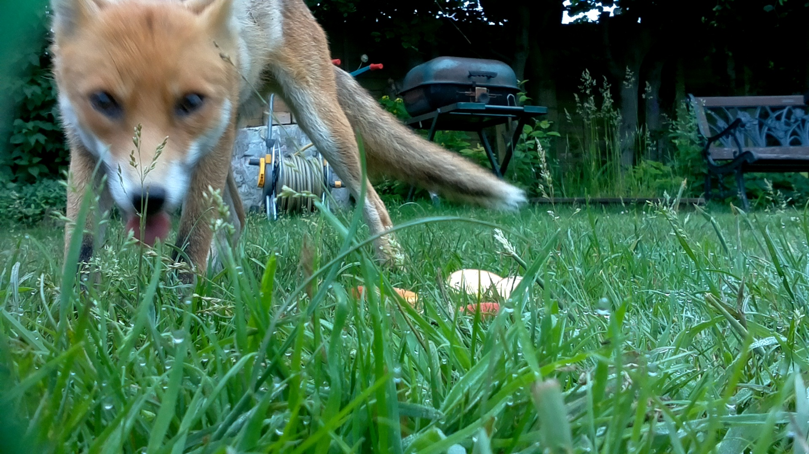
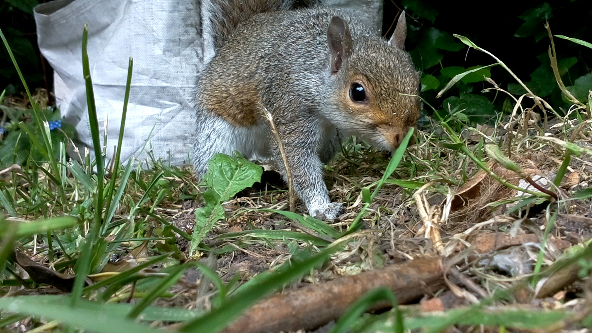

# My Naturewatch
## Interaction Research Studio, Goldsmiths University of London
**Design Products, Royal College of Art**

For the last year or so, our team of design researchers from the Interaction Research Studio at Goldsmiths University of London and Design Products at the Royal College of Art have been working on devices that people can make themselves and use to engage with their local wildlife.

We've explored a number of possibilities, some more practical and others more playful. Now we have released instructions for making our first design on our website, [www.mynaturewatch.net](http://www.mynaturewatch.net).

#### An open-Source wildlife camera

My Naturewatch Camera uses computer vision software that we've developed in our studio to 'see' when something is moving and take its picture. Set out in the garden with a bit of bait, it can capture quite striking portraits of the birds and animals that live around us --- often quite intimate or even funny.

Image 1. Fox, Leila Rascaniere.

The basic version takes only about an hour or so to make and is very 'tech light' (e.g., no soldering!). In fact, most time is spent rigging up a simple waterproof 'housing' from household items like food storage containers or empty plastic bottles. There's also an infrared version that takes nighttime pictures, which is only a little more challenging to make.

My Naturewatch Camera featured on an episode of BBC's amazing Springwatch 2018, triggering an overwhelming number of people to take up the design. In fact, we're not sure how many people have made the cameras! It seems to be a lot, though: about 37,000 people visited mynaturewatch.net in the month after the show, more than 2000 downloaded the software for the cameras, and almost 1000 bought the technology needed to make them from just one of the potential suppliers. We're estimating that somewhere between 1500 -- 2000 people have made the cameras, but it could be more.

What we do know is that hundreds of amazing photos of hedgehogs, foxes, squirrels, chiffchaffs, parrots, magpies, robins and wood pigeons have appeared on social media and our own website forum, and that more people are signing up every day.

Moreover, it's clear that while some makers are remarkably sophisticated, making elaborate enclosures, adding new controls and changing the software, for a large number of people building a My Naturewatch Camera is their first foray into digital making.

It has been tremendously exciting to see our design promote engagement with the wildlife and technology in this way -- and great to know that the two are not mutually incompatible.

#### What's a freader?

We've also been working on a RFID-reading bird feeder ('freader') that can track birds fitted with special RFID rings.

Image 2. mynwcamera

Image 3. Feader.

Ornithologists are really excited about this one. Normal bird rings require that birds be recaptured to be read, but RFID rings can be read automatically --- they use the same technology as contactless payment or transport cards. This is a lot better for ornithologists and birds alike.

Our design is much cheaper than commercial versions, and it's easy to make (though it does involve a little soldering), so it could help revolutionise ornithological studies.

Unlike the My Naturewatch Cameras, it doesn't make sense for people to make the freaders at home, yet. Birds can only be RFID-ringed as part of studies approved by the British Trust for Ornithology, so the freaders are best deployed under the guidance of the scientists running studies.

So, after a successful test of the freaders on Goldsmiths' campus, we're planning a larger scale study in Nottinghamshire with the help of two licenced ornithologists, Jamie Dunning and Michael Pearson. This will let us work out the practicalities of deploying the freaders over a large area, without external power or internet access.

Once the freader designs are finalised, however, we're hoping more ornithologists will make them. In the long run, if enough birds are tagged, and enough people make the freaders, we could build a nationwide network providing unprecedented information about birds' movements. Imagine being able to track the progress of a bird from your home as it makes its way through the neighbourhood and beyond!

#### An ongoing project

Instructions for building My Naturewatch Cameras are on our website [www.mynaturewatch.net](http://www.mynaturewatch.net) so that anybody can make their own. We'd love to see photos people get with their My Naturewatch Cameras, so please share them and use \#mynaturewatch on social media.

The project isn't done yet, either, so watch the site for news and new designs!
