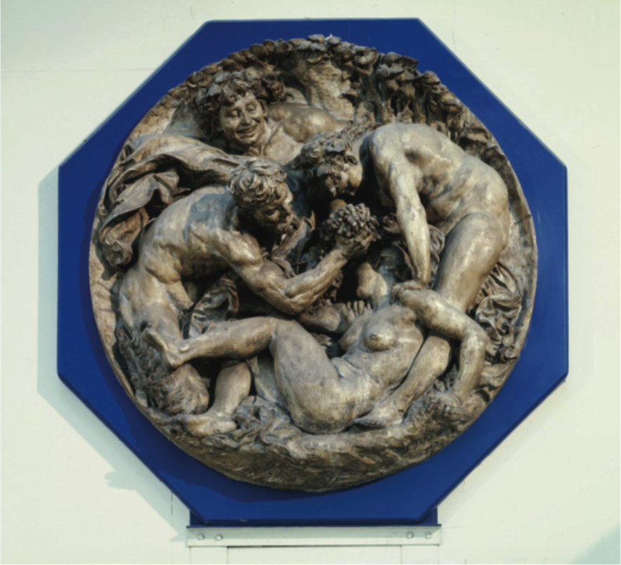

--- 
title: wakefulness, wine, noise and shouts
layout: default 
---

# Wakefulness, wine, noise and shouts
## Georgina Voss

Where do the mysteries live? Down in the darkness, up on the hillside. Secrets and signs; partial truths; small fragments of light in the gloom.

---

How shall we learn to make an intelligent system? We create that entity and we feed it. We teach it to learn. There is no defined *thing* here, of course; simply a rotating assemblage of technologies that we bind together -- machine learning, natural language processing, reasoning, perception. Pump it full of training sets and raise it as our beautiful, precocious, distributed child.

What shall our clever baby do? What could you company achieve if every interaction with technology were intelligent? We think that artificial intelligence can meaningfully improve people's lives. We believe artificial intelligence will touch every corner of society. We believe artificial intelligence will transform the world in dramatic ways in the coming years/

---

Where do the mysteries live? Though the grove in the dead of night. Say his name -- Liber, Dionysus, Bacchus. Oh, liberator! The embodiment of most joyful freedoms, whose divine mission is to bring an end to care and worry. Through drunkenness and madness he frees us from the heavy weight of our lives; through release, he brings civilisation and peace.

Here then is the Bacchanalia, that festival of sweet ecstasy, filled with swelling masses of bodies. when we loosen from the ordeal of ourselves. Our man on the ground in Rome, our reporter Livy, tells us of the sweat and the mess, the debauchery in the ritual enactment of the maenads' frenzies. Hear how men 'as if insane, with fanatical tossings of their bodies, would utter prophesies'[1](#fn1). In these ecstatic transcendental communions, we loosen from the ordeal of ourselves.

---

Feed something into a system and it stays in and stains. Nourish an infant intelligence with half-baked lines and it will keenly absorb them, amplifying the fault-lines as it grows. Give it some incomplete and partial training sets and it will accept them, wide-eyed, as a whole and perfect truth.

---

Too much chaos, too little light. Rome passes a law in 186BC to suppress the Bacchic mystery cult. *senatus consultum de Bacchanalibus!* No men shall be priests of Dionysus! Sacred rites are only permitted in the very smallest of groups -- no more than five, and of them no more than two men or three women, and of that only with the very strictest permissions.

Our reporter, Livy, documenting all along -- the thousands of followers arrested, most of whom were executed; the shrines, destroyed. The case made that the cult of Bacchus was, truth, be told, a roiling morass of sexual and criminal activities. Murder! Perjury! Forgery! Poison! How could Senate permit safe haven to such misdeeds?

---

The manifestation of a system is controlled by its gatekeepers.

We make our intelligent baby; it is not simply born. And the 'we' who make the systems tend to specific demographics; men who are extremely well-educated and *extremely* well-paid. Power is materialised by those who make things. We pay attention to what we care about. Listen in: the composition of those able or allowed to develop AI systems is a fundamental area where inequality may be exacerbated'[2](#fn2).

Algorithms used by police enforcement agencies predict that black defendants pose a higher risk of recidivism than they do[3](#fn3) AND systems show high-income job ads to men more than women[4](#fn4) AND tools are being developed to specifically detect the movement of people across international borders[5](#fn5).

AND. And.

---

The *mysteries* of Dionysus, though.

A cult who held their gatherings in strict privacy and who bound their initiates to secrecy; subjugated by Senate, their members executed, their places of worship obliterated. Our data-set is incomplete. What we have emerges through a transformation of representation -- the plays, the paintings, the sculptures. Even -- especially! - our documenter Livy holds a partial perspective. His documentations tend to the lurid; his description of the Bacchanalia as the 'workshop of all kinds of evil'[6](#fn6) raises an eyebrow.

Try this for size instead. Perhaps the worship of any foreign deities could be perfectly well accommodated in Rome *if* the ruling classes were able to sanction and control them. Perhaps those unruly and unauthorised Bacchae, howling in the night, posed more of a threat to the political control of Roman than to any moral texture[7](#fn7).

Perhaps these subjugations sent a message: We can tolerate the terrible dark leanings of a system provided that they are *our* terrible dark leanings.

Image 1. Bacchanal, Aimé-Jules Dalou, 1879. Given by the daughter of the sculptor Sir Joseph Edgar Boehm. Museum number 434-1896
© Victoria and Albert Museum, London

All perspectives are partial, surrounded by the dark. Men, as if insane, with fanatical tossings of their bodies, uttering prophesies.

**References:**

<ol>
<li id="fn1">*Livy 39:12:12.*<a href="#fnref1">↩</a></li>
<li id="fn2">Kate Crawford, Meredith Whittaker . (2016). *The Social and     Economic Implications of Artificial Intelligence Technologies in the     Near-Term.*Available:     https://ainowinstitute.org/AI\_Now\_2016\_Report.pdf. Last accessed     22nd August 2018.<a href="#fnref2">↩</a></li>
<li id="fn3">Jeff Larson, Surya Mattu, Lauren Kirchner, Julia Angwin.     (2016). *How We Analyzed the COMPAS Recidivism     Algorithm.* Available:     https://www.propublica.org/article/how-we-analyzed-the-compas-recidivism-algorithm.     Last accessed 22nd August 2018.<a href="#fnref3">↩</a></li>
<li id="fn4">Iv Amit Datta, Michael Carl Tschantz, Anupam Datta.     (2015). *Automated Experiments on Ad Privacy Settings: A Tale of     Opacity, Choice, and Discrimination.* Available:     https://arxiv.org/abs/1408.6491. Last accessed 22nd August 2018.<a href="#fnref4">↩</a></li>
<li id="fn5">Steven Levy. (2018). *INSIDE PALMER LUCKEY'S BID TO BUILD A BORDER     WALL.* Available:     https://www.wired.com/story/palmer-luckey-anduril-border-wall/. Last     accessed 22nd August 2018.<a href="#fnref5">↩</a></li>
<li id="fn6">*Livy 39.10.6*<a href="#fnref6">↩</a></li>
<li id="fn7">Takács, Sarolta A. \"Politics and Religion in the Bacchanalian     Affair of 186 B.C.E.\" *Harvard Studies in Classical Philology* 100     (2000): 301-310.<a href="#fnref7">↩</a></li>
</ol>
